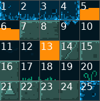
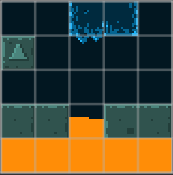

# 2DMapEditor

A minimalist 2D map editor.

Create single layer 2D maps from a .png tileset.

Export maps to txt, json, lua format.

Made with [love2d](https://love2d.org/).

## Preview


Tileset from https://ansimuz.itch.io/grotto-escape-game-art-pack

## Features

- Edition:
	- Resize
	- Draw
	- Erase
	- Fill
	- Tile Picker
	- Clear
- Movement:
	- Move
	- Zoom
- Display:
	- Toggle grid
	- Reset
- Import:
	- .txt
	- .json
	- .lua
- Export:
	- .txt
	- .json
	- .lua
- Set settings from editor.txt
- Tiles display as drawing palette

---

## Usage Instructions

This minimalist software does not provide any integrated tips or documentation, you should refer to this section if you need help.

### Get started

- Linux/MacOS install [love2d v11](https://love2d.org).
- Download the map editor.
- Unzip it.
- Add at least one tileset in the tileset/ directory.
- Edit the "editor.txt" file next to the map editor and change some settings to fit your need.
- Run the map editor (on Linux/MacOS either double click on the .love file or use `$ love 2d_map_editor.love` from the command prompt).
- Create a map.
- Export your map.
- Your exported map should now appear in the map/ directory.

### Shortcuts

| Keys 	| Description |
|---	|---
| <kbd>D</kbd>	|	Draw	|
| <kbd>E</kbd>	|	Erase	|
| <kbd>F</kbd>	|	Fill	|
| <kbd>Alt</kbd>	|	Tile picker	|
| Mouse Right	|	Tile picker	|
| <kbd>←</kbd><kbd>↑</kbd><kbd>→</kbd><kbd>↓</kbd>	|	Move	|
| <kbd>Spacebar</kbd> + Mouse Left	|	Move	|
| Mouse Wheel	| Zoom	|

---

## Input/Output Format

A 2d map is encoded as a 2d array of numbers. Each number matches a tile from the tileset.

Considering the following tileset:



And this 2d array of number:

```lua
{
	{19, 19,  1,  4, 19},
	{21, 19,  9, 19, 19},
	{19, 19, 19, 19, 19},
	{16, 16,  6, 15, 16},
	{13, 13, 13, 13, 13}
}
```

We get the following map:




## Importing a Map to Your Project

### With Lua (5.1)

If your using the lua programming language, just require the map in your project:
```lua
local map = require("path/to/my/map")
```

### Without Lua

Create/find a parser for the file format you want your map to be in.

---

## Building

Builds are done using the "Release" script that itself uses [boon](https://github.com/camchenry/boon).
Running `./Release` will create a folder named "release", using `./Release -z` will zip the folders contained in the release folder.

---

## Project Status

The project is currently finished, however feel free to open an issue if you encounter one. No features will be added.

## Why this Project & more...

Initialy I wanted to be able to create maps for my 2d games, I tried [tiled](https://www.mapeditor.org/) but it's a big editor with tons of features and it was exporting maps in the json format, so I should have learned how to use the editor and use a library to parse json files.

Since I only needed single layers maps I started this little project.
It was one of my first desktop application so it was very interesting on many points.

I created the map editor 2+ years ago but I never finished some features/polish but used it in multiple projects like [It Alive](https://mathurin.itch.io/italive). It's why I came back on it with the desire to make the initial idea come true.
I find the project/code structure really bad now and that's a good thing, it means that my programming practices/skills have improved since.
If I had to do it again now, I would do it in a much different maner.
Thanks for reading.
